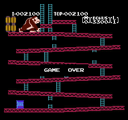
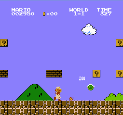

## What is cNES

cNES is a NES emulator which is only supported under Linux. It currently
loads NROM (mapper 0) games and is capable of loading the title screen of
these games (in theory), games tested: _Super Mario Bros, Donkey Kong and
Balloon Fight_.

cNES is the result of me wanting to get more experienced with _C_ and to work on
some sort of computer architechture project. I settled on the NES due to the exntensive
doumentation, especially that of the CPU and the [meduim article](https://medium.com/@fogleman/i-made-an-nes-emulator-here-s-what-i-learned-about-the-original-nintendo-2e078c9b28fe)
by fogleman. There is already a plethera of NES projects online, so I wanted to make this project
mine and to not abandon the project or copy code; whilst learning about the hardware. Its been a 
challenge and the result so far is an emulator that isn't perfect but one I'm proud of!

## Screenshots

## Todo
* Add sprites (DMA has been added and works)
* Add sprite logic (i.e. sprite #0 hit detection)
* Move debugg triggering from emu.c to command line options
* Process controller input
* Add audio support
* Potentially add support for other mappers (once above is all done)

## Building cNES
cNES can be compiled and used on Linux.

**Requirements:**
* C99 compatible compiler
* SDL2 (Used to render screen)
* gcc (clang returns incorrect values from LDA $2002)

With the requirements satisfied. It is as simple as:

        $ make
  
**Optional settings:**
  
Edit the `#define` macros in [emu.c](src/emu.c) by either commenting out these macros to disable 
the feature or uncommenting to enable them:

`#define __LOG__` - Outputs CPU and PPU information to a file called "trace_log.txt"
  
`#define __DEBUG__` - Outputs CPU and PPU information to the terminal

	
## Running cNES

Choosing a game: edit [emu.c](src/emu.c) line ~10: `const char *filename = "super_mario_bros.nes";  // Change if necessary`

Other notes: cNES at the moment runs for a specific amount of time, again edit the main loop of [cNES](src/emu.c) if you wish to disable this
  
Run cNES:

        $ ./emu
	
Controls:
* Not implemented yet
 

## License
cNES is zlib licensed, as found in the [`LICENSE`](LICENSE) file.

## Acknowledgments

https://www.dwheeler.com/6502/oneelkruns/asm1step.html

  
https://github.com/paramsingh/gameboi

> At a certain point I understood how the NES PPU worked and how background rendering worked
but I was unable to put this thinking into code. This project massively helped me because
it served as a readable reference on how to add SDL2 into my project.
  
https://github.com/mwillsey/NES
  
> Again this massively helped my PPU progress. I understood the background rendering of the
PPU and wanted to implement the rendering of a fixed nametable i.e. starting from $2000.
So I attempted to see if I could render the title screen (of Donkey Kong). This project helped
me build my first iteration of my PPU. They also calculated a fixed nametable (no scrolling),
I used their project to help render the title screen of Donkey Kong which it did but not correctly.
Nonetheless it was an important breakthrough and my project wouldn't be where it is now without
this project. Earlier in my project I used this project's cartridge.c file as a template on how
to code my cart.c
  
https://github.com/SourMesen/Mesen
  
> I wouldn't of made so much progress on my PPU and fixing my CPU bugs without the amazing
debugging qualities of Mesen. It is a great emulator and several times I've consulted their
source code to better my understanding of how to successfully emulate the NES.